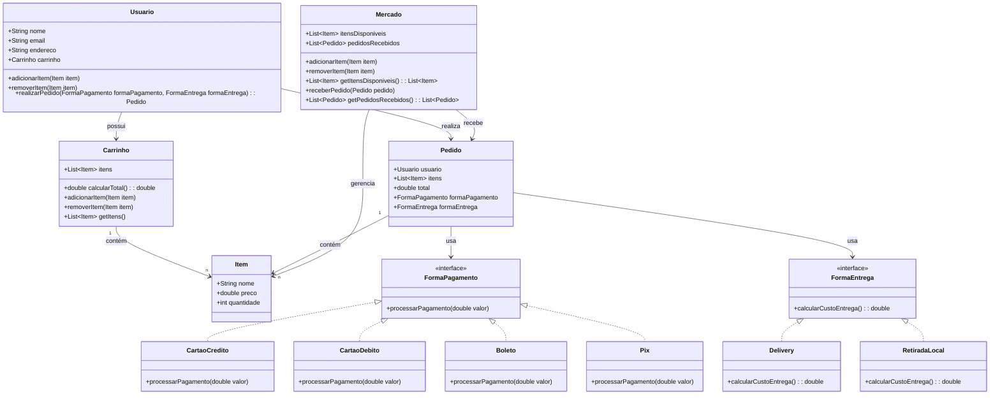

#diagrama de classes do projeto 

```mermaid
classDiagram
    class Usuario {
        +String nome
        +String email
        +String endereco
        +Carrinho carrinho
        +adicionarItem(Item item)
        +removerItem(Item item)
        +realizarPedido(FormaPagamento formaPagamento, FormaEntrega formaEntrega) : Pedido
    }

    class Item {
        +String nome
        +double preco
        +int quantidade
    }

    class Carrinho {
        +List~Item~ itens
        +double calcularTotal() : double
        +adicionarItem(Item item)
        +removerItem(Item item)
        +List~Item~ getItens()
    }

    class Pedido {
        +Usuario usuario
        +List~Item~ itens
        +double total
        +FormaPagamento formaPagamento
        +FormaEntrega formaEntrega
    }

    class FormaPagamento {
        <<interface>>
        +processarPagamento(double valor)
    }

    class CartaoCredito {
        +processarPagamento(double valor)
    }

    class CartaoDebito {
        +processarPagamento(double valor)
    }

    class Boleto {
        +processarPagamento(double valor)
    }

    class Pix {
        +processarPagamento(double valor)
    }

    class FormaEntrega {
        <<interface>>
        +calcularCustoEntrega() : double
    }

    class Delivery {
        +calcularCustoEntrega() : double
    }

    class RetiradaLocal {
        +calcularCustoEntrega() : double
    }

    class Mercado {
        +List~Item~ itensDisponiveis
        +List~Pedido~ pedidosRecebidos
        +adicionarItem(Item item)
        +removerItem(Item item)
        +List~Item~ getItensDisponiveis() : List~Item~
        +receberPedido(Pedido pedido)
        +List~Pedido~ getPedidosRecebidos() : List~Pedido~
    }

    Usuario --> Carrinho : possui
    Carrinho "1" --> "n" Item : contém
    Usuario --> Pedido : realiza
    Pedido "1" --> "n" Item : contém
    Pedido --> FormaPagamento : usa
    Pedido --> FormaEntrega : usa
    FormaPagamento <|.. CartaoCredito
    FormaPagamento <|.. CartaoDebito
    FormaPagamento <|.. Boleto
    FormaPagamento <|.. Pix
    FormaEntrega <|.. Delivery
    FormaEntrega <|.. RetiradaLocal
    Mercado --> Pedido : recebe
    Mercado --> Item : gerencia
```
